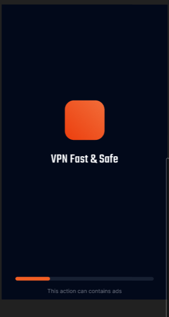
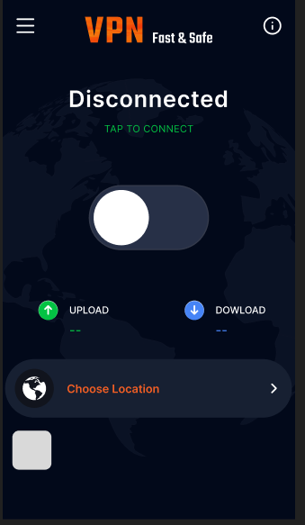
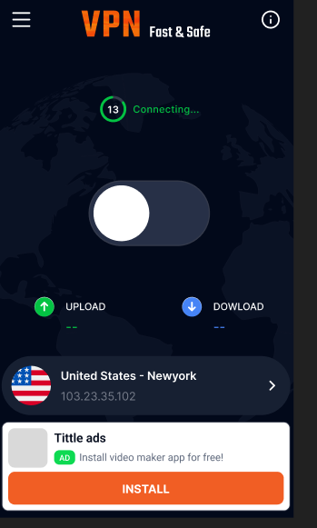

# AI VPN Fast Safe

  
  
  

## 📋 Tổng quan

AI VPN Fast Safe là ứng dụng VPN mạnh mẽ, an toàn và thân thiện với người dùng được xây dựng bằng Flutter. Ứng dụng cung cấp kết nối VPN bảo mật, đa dạng máy chủ và giao diện hiện đại, đồng thời tích hợp nhiều tính năng hữu ích cho người dùng.

## ✨ Tính năng chính

### 🔒 Kết nối VPN

- **Kết nối nhanh chóng**: Chỉ cần một lần chạm để kết nối đến máy chủ VPN
- **Nhiều máy chủ toàn cầu**: Hỗ trợ nhiều máy chủ từ nhiều quốc gia khác nhau (Mỹ, Anh, Nhật, Đức, Singapore, Canada, Úc, Ấn Độ, Pháp,...)
- **Hiển thị thông tin**: Hiển thị dữ liệu tải lên/tải xuống trong thời gian thực
- **Đếm ngược thời gian kết nối**: Theo dõi thời gian đã kết nối với VPN

### 🌐 Quản lý máy chủ

- **Chọn vị trí**: Người dùng có thể dễ dàng thay đổi máy chủ VPN
- **Hiển thị quốc gia**: Mỗi máy chủ được hiển thị với quốc kỳ tương ứng
- **Hiển thị địa chỉ IP**: Xem địa chỉ IP hiện tại sau khi kết nối

### 🔍 Kiểm tra mạng

- **Kiểm tra tốc độ mạng**: Đo tốc độ mạng Internet
- **Kiểm tra kết nối**: Xác minh kết nối trước khi sử dụng VPN

### 🌍 Đa ngôn ngữ

- **Hỗ trợ 16+ ngôn ngữ**: Tiếng Anh, Việt Nam, Tây Ban Nha, Pháp, Đức, Trung Quốc, Nhật Bản, Hàn Quốc, Ả Rập, Hindi, Bồ Đào Nha, Nga, Thổ Nhĩ Kỳ, Đan Mạch, Thái Lan, Indonesia,...
- **Lựa chọn ngôn ngữ**: Người dùng có thể thay đổi ngôn ngữ theo ý thích

### 📊 Phân tích dữ liệu

- **Firebase Analytics**: Theo dõi hành vi người dùng để cải thiện ứng dụng
- **Hiệu suất sử dụng**: Phân tích các mẫu sử dụng VPN

### 🛠️ Tính năng khác

- **Đánh giá ứng dụng**: Người dùng có thể đánh giá và gửi phản hồi
- **Chia sẻ ứng dụng**: Chia sẻ ứng dụng với bạn bè và người thân
- **Chính sách bảo mật**: Thông tin đầy đủ về chính sách bảo mật

## 🔧 Công nghệ sử dụng

- **Flutter & Dart**: Framework phát triển giao diện đa nền tảng
- **GetX**: Quản lý trạng thái, điều hướng và tiêm phụ thuộc
- **Firebase**:
  - Firebase Core: Nền tảng cho các dịch vụ Firebase
  - Firebase Analytics: Thu thập và phân tích dữ liệu người dùng
  - Firebase Remote Config: Cấu hình ứng dụng từ xa
- **OpenVPN**: Thư viện kết nối VPN bảo mật
- **Google Mobile Ads**: Tích hợp quảng cáo (Banner, Native, Interstitial)
- **Hive**: Lưu trữ dữ liệu cục bộ nhẹ và nhanh
- **Shared Preferences**: Lưu trữ cài đặt ứng dụng
- **Flutter SVG**: Hiển thị hình ảnh vector
- **Lottie**: Hoạt ảnh đẹp mắt
- **Connectivity Plus**: Kiểm tra trạng thái kết nối mạng
- **URL Launcher**: Mở URL trong trình duyệt hoặc ứng dụng khác

## 📱 Màn hình chính

1. **Splash Screen**: Màn hình khởi động với animation đẹp mắt
2. **Home Screen**: Màn hình chính với nút kết nối VPN và thông tin tải lên/xuống
3. **Location Screen**: Màn hình chọn máy chủ VPN với các quốc gia khác nhau
4. **Settings Screen**: Các cài đặt ứng dụng (ngôn ngữ, đánh giá, chia sẻ, chính sách)
5. **Language Screen**: Chọn ngôn ngữ hiển thị cho ứng dụng
6. **Network Test Screen**: Kiểm tra tốc độ và chất lượng mạng
7. **Rating Screen**: Cho phép người dùng đánh giá ứng dụng
8. **Privacy Policy**: Thông tin về chính sách bảo mật

## ⚙️ Cài đặt và Thiết lập

### Yêu cầu

- Flutter SDK: ≥3.6.0
- Dart SDK: ≥3.6.0
- Android Studio hoặc VS Code
- Firebase project đã thiết lập

### Cài đặt

1. Clone repository
2. Chạy `flutter pub get` để cài đặt các phụ thuộc
3. Kết nối project với Firebase của bạn
4. Thiết lập các ID quảng cáo trong Firebase Remote Config
5. Chạy `flutter run` để khởi chạy ứng dụng

## 📄 License

Ứng dụng này được phát hành dưới giấy phép [MIT License](LICENSE).

## 👨‍💻 Nhà phát triển

Ứng dụng được phát triển bởi DucThanhNguyen.
